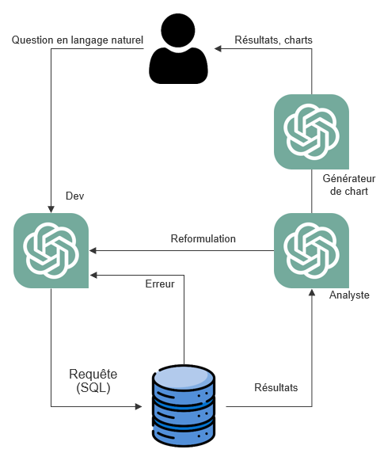
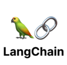

# Rescue-L (not sure of the name lol)

## Overview

**Rescue-L** is an advanced AI solution designed to enable natural language interaction with SQL databases. By leveraging the power of large language models (LLMs) through a multi-agent architecture, Rescue-L transforms user queries into SQL commands, retrieves relevant data, and delivers concise, accurate results. 

<p align="center">
  
</p>

---

## Features

- **Natural Language to SQL Queries**: Convert user input into SQL queries through natural language processing.
- **Multi-Agent Collaboration**:
  - **Developer Agent**: Translates user requests into syntactically correct SQL queries, validating and refining query accuracy.
  - **Analyst Agent**: Analyzes SQL query results, generating human-readable reports and clarifications.
  - **Visualization Agent**: Automatically generates data visualizations using Python's Altair, enhancing insights presentation.
- **Database Compatibility**: Compatible with a wide range of database management systems.

---

## Architecture

### Multi-Agent Framework

<p align="center">
  
</p>


## Technical Details

### Core Technologies

<p align="center">


</p>

- **LLM Wrappers**: Flexible interaction with various large language models.
- **Database Management Systems Compatibility**: Seamless integration with multiple database types.
- **Open and Closed Source APIs**: Incorporates diverse generative AI services for robust data interaction.

---

## Future Enhancements

- **Handling Sparse Databases**: Improving robustness when working with fragmented data.
- **Expanded Data Discovery**: Enabling automatic business insights generation.
- **Enhanced Contextual Memory**: Leveraging user interaction history for personalized responses.

---

## Quick Start

1. Clone this repository:
```bash
git clone https://github.com/thbdoux/Rescue-L.git
```
2. Setup the environment:
```bash
pip install -r requirements.txt
```

3. Start the Streamlit WebApp:
```bash
streamlit run app.py
```
